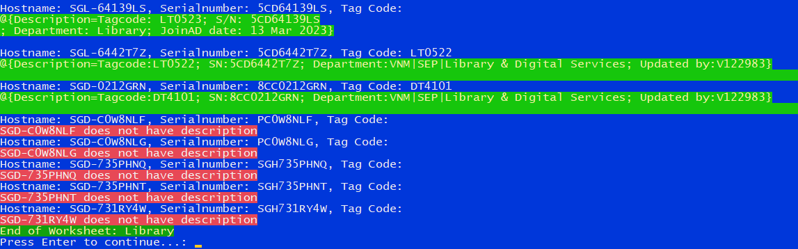

# PowerShell Script for Excel Workbook and Active Directory Manipulation

This PowerShell script is designed to manipulate an Excel workbook and update Active Directory (AD) computer descriptions. It operates on a specified worksheet in the workbook and iterates over each row in the used range of the worksheet.

## Features

- Iterates over each row in the used range of a specified worksheet.
- Retrieves the hostname, serial number, tag code, and department from each row.
- If the tag code or department is null, it skips the current row and continues with the next one.
- Retrieves the AD computer object for the hostname.
- If the computer is not found on AD, it skips the current row and continues with the next one.
- Updates the AD computer description with the tag code, serial number, and department.
- Updates a specific column in the worksheet with "Done" after successfully updating the AD computer description.

## Usage

1. Replace the `$filePath` variable with the path to the Excel workbook you want to manipulate.
2. Replace the `$credentials` variable with your AD credentials.
3. Run the script in a PowerShell environment.

## Requirements

- Excel must be installed on the machine where the script is run.
- The user running the script must have the necessary permissions to change the attributes of the file, perform operations on the Excel workbook, and update AD computer descriptions.

## Note

This script is intended to be used with workbooks that have a specific structure. If your workbook is structured differently, you may need to adjust the script accordingly.

***Please remember to handle all data with care and ensure you have the necessary permissions before running the script. 😊***
